 

  

  

 

---

 

## 
⚡ TECH ARSENAL

 

### LANGUAGES

 

### FRONTEND

 

### BACKEND

 

### DATABASE & CLOUD

 

### AI & LLMS

 

---

 

## 
🚀 FEATURED PROJECTS

 

 

| LLMTAP | RAKSETU | CHILD SAFE O₂ |
|:---:|:---:|:---:|
| **LLM Observability** | **Blood Donation Network** | **Vehicle Safety IoT** |
| TypeScript • React • Fastify | React • Firebase • ML | Embedded • GSM • IoT |
| 50+ Models • Zero-config SDK | 95.25% Accuracy • Real-time | PIR Sensors • Auto-alerts |

 

---

 

## 
🏆 ACHIEVEMENTS

 

| 🥇 | 🌍 | 🥉 |
|:---:|:---:|:---:|
| **IGNITE 2026** | **Social Impact Award** | **Hack-A-Cure** |
| *1st Place* | *Global Finalist* | *3rd Place* |
| 860+ Teams | Top 24 of 464 | VIT Chennai |

 

---

 

## 
📜 CERTIFICATIONS

 

-000000?style=for-the-badge&logo=google-cloud&logoColor=DC143C&labelColor=000000)

 

---

 

### 💼 Open for Opportunities

**Full-time • Freelance • Open Source • Hackathons**

 

 

