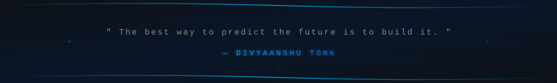

<div align="center">

<!-- HEADER BANNER -->


<!-- TYPING SVG -->


<br/>

<!-- QUICK LINKS -->
<a href="https://linkedin.com/in/divyaanshutonk"></a>&nbsp;
<a href="mailto:divyaanshutonk@gmail.com"></a>&nbsp;
<a href="https://github.com/DivyaanshuXD"></a>&nbsp;
<a href="https://divport.vercel.app"></a>

<br/>

`📍 Hyderabad, Telangana` &nbsp; `📧 divyaanshutonk@gmail.com` &nbsp; `💼 Backend Developer` &nbsp; `🌐 divport.vercel.app`

<br/>


</div>

<br/>

<!-- ABOUT ME -->

 **About Me**


I'm a **Computer Science undergraduate** focused on building scalable systems, developer tools, and real-world applications.

```yaml
name: Divyaanshu Tonk
role: Full-Stack Developer
location: Hyderabad, India
currently_building: LLM Observability Tools & Real-Time Platforms
portfolio: https://divport.vercel.app
```

**What drives me:**

- 🏗️ &nbsp; Full-stack and backend engineering
- 🤖 &nbsp; AI-based systems and developer tooling
- ⚡ &nbsp; Real-time platforms and system design
- 🎯 &nbsp; Performance optimization and scalability
- 🧪 &nbsp; Building projects designed for **real-world usage**

<br clear="right"/>

---

<!-- TECH STACK -->

<h2 align="center">🛠️ Tech Arsenal</h2>

<div align="center">

<table>
<tr>
<td align="center" width="160">
<h4>💻 Languages</h4>
</td>
<td align="center" width="160">
<h4>🌐 Frontend</h4>
</td>
<td align="center" width="160">
<h4>⚙️ Backend</h4>
</td>
<td align="center" width="160">
<h4>🗄️ Databases</h4>
</td>
<td align="center" width="160">
<h4>🧰 Tools</h4>
</td>
</tr>
<tr>
<td align="center">
<br/><sub>Python</sub><br/>
<br/><sub>Java</sub><br/>
<br/><sub>JavaScript</sub><br/>
<br/><sub>TypeScript</sub><br/>
</td>
<td align="center">
<br/><sub>React</sub><br/>
<br/><sub>Vite</sub><br/>
<br/><sub>Tailwind</sub><br/>
<br/><sub>HTML5</sub><br/>
<br/><sub>CSS3</sub>
</td>
<td align="center">
<br/><sub>Node.js</sub><br/>
<br/><sub>Express</sub><br/>
<br/><sub>Fastify</sub><br/>
<br/><sub>Firebase</sub>
</td>
<td align="center">
<br/><sub>MongoDB</sub><br/>
<br/><sub>MySQL</sub><br/>
<br/><sub>SQLite</sub>
</td>
<td align="center">
<br/><sub>Git</sub><br/>
<br/><sub>GitHub</sub><br/>
<br/><sub>VS Code</sub><br/>
</td>
</tr>
</table>

<br/>

**📚 Core Concepts**


</div>

---

<!-- PROJECT PODIUM -->

<h2 align="center">🏟️ Project Podium</h2>

<div align="center">
<b>Three projects that define how I build, backend-heavy systems, AI tooling, and real-world platforms.</b>
</div>

<br/>

<div align="center">

<table width="100%">
<tr>
<td width="30%" align="center" valign="bottom">

### 🥈 Raksetu
**Smart Blood Donation Network**

[](https://raksetu.vercel.app)

<sub>Real-time blood request workflows, donor engagement, ML retention, and emergency communication tooling.</sub>

<br/>


<br/><br/>

<b>Top 24 / 464</b><br/>
<sub>Global Finalist, Social Impact Award</sub>

</td>

<td width="40%" align="center" valign="top">

# 🥇 LLMTap
### **Local-First LLM Observability Platform**

[](https://github.com/DivyaanshuXD/LLMTap)

<sub>Built around a real developer problem, tracing, cost analytics, request visibility, and real-time debugging for LLM applications without forcing cloud lock-in.</sub>

<br/>


<br/><br/>

<table>
<tr>
<td align="center">🔧 <b>Tracing</b></td>
<td align="center">💸 <b>Cost Visibility</b></td>
<td align="center">⚡ <b>Live Debugging</b></td>
</tr>
<tr>
<td align="center">📦 <b>Monorepo</b></td>
<td align="center">🖥️ <b>Dashboard + CLI</b></td>
<td align="center">🧠 <b>Infra-Minded Tooling</b></td>
</tr>
</table>

</td>

<td width="30%" align="center" valign="bottom">

### 🥉 ChildSafe O2
**Vehicle Child Safety System**

[](https://github.com/DivyaanshuXD/ChildSafe-O2)

<sub>Embedded safety prototype for child detection, GSM alerting, and automated ventilation inside locked vehicles.</sub>

<br/>


<br/><br/>

<b>Hardware Safety Prototype</b><br/>
<sub>Alerting + fail-safe ventilation workflow</sub>

</td>
</tr>
</table>

</div>

<br/>

---


<!-- ACHIEVEMENTS -->

<h2 align="center">🏆 Achievements</h2>

<div align="center">

<table>
<tr>
<td align="center" width="280">
<br/><br/>
<b>IGNITE 2026</b><br/>
National Level Project Expo<br/>
<sub>🏅 1st among <b>860+ teams</b></sub>
</td>
<td align="center" width="280">
<br/><br/>
<b>Hack-A-Cure, VIT Chennai</b><br/>
<a href="https://github.com/DivyaanshuXD/HackACure-RAG-Based-ChatBot">Medical RAG Bot</a><br/>
<sub>🏅 Competitive hackathon win</sub>
</td>
<td align="center" width="280">
<br/><br/>
<b>Social Impact Award</b><br/>
Raksetu Platform<br/>
<sub>🏅 Top <b>24 of 464</b> teams worldwide</sub>
</td>
</tr>
</table>

</div>

---


<!-- PORTFOLIO SIGNBOARD -->

<h2 align="center">🎯 Full Portfolio</h2>

<div align="center">

<table width="100%">
<tr>
<td align="center">

## ⚡ Want the full picture?

### Live portfolio with project walkthroughs, stronger presentation, and a cleaner product view.

<br/>

<a href="https://divport.vercel.app">
  
</a>
&nbsp;
<a href="https://divport.vercel.app">
  
</a>

<br/><br/>

**Explore:** project showcases • design polish • live presentation • deeper profile view

</td>
</tr>
</table>

</div>

---

<!-- CONNECT -->

<h2 align="center">🤝 Let's Connect</h2>

<div align="center">

<p>
Interested in collaborating on <b>Backend Systems</b>, <b>AI Tools</b>, <b>Full-Stack Apps</b>, <b>Hackathons</b>, or <b>Real-World Tech Projects</b>?
</p>

<br/>

<a href="https://linkedin.com/in/divyaanshutonk"></a>&nbsp;&nbsp;
<a href="mailto:divyaanshutonk@gmail.com"></a>&nbsp;&nbsp;
<a href="https://github.com/DivyaanshuXD"></a>&nbsp;&nbsp;
<a href="https://divport.vercel.app"></a>

<br/><br/>

</div>

<!-- FOOTER -->
<div align="center">

</div>
